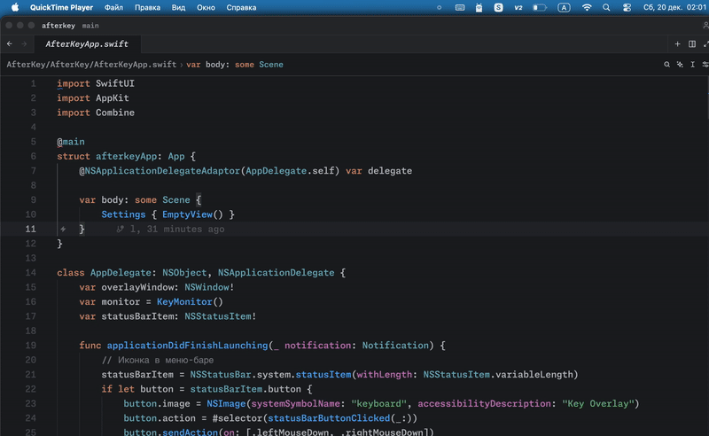

# AfterKey

A simple and minimalistic keystroke overlay.
Shows pressed keys on screen as translucent buttons.

## Platforms

### macOS

Native Swift/SwiftUI app. See [macos/](macos/) for source.

[Download macOS build](https://t.me/publicmetalhead/93)

### Linux

C++ / Qt6 / evdev. Supports KDE Plasma, Wayland, X11.
See [linux/](linux/) for source and build instructions.

### Windows (alpha)

C# / WPF / .NET 8. Zero external dependencies.
See [windows/](windows/) for source and build instructions.

## Features

- Translucent key overlay with modifier support
- Configurable position (9 positions), colors, font size, border, opacity
- System tray integration
- Adjustable display duration and max visible keys
